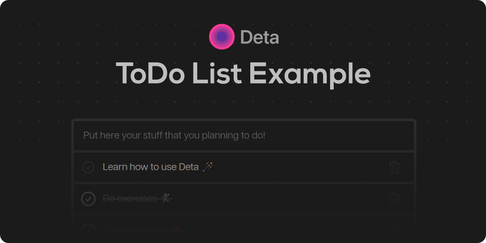

An example full-stack app that runs on [Deta Space](https://deta.space/)!

The main components of the project are:

* `/frontend` - Client side app, made with vanilla JavaScript and bundled using Vite

* `/backend` - Simple CRUD Express server that stores data using **Deta Base**

* `Spacefile` - configuration for deploying this app to **Deta Space** 💫


## Development

1. Install [Node.js](https://nodejs.org/en/). Preferably LTS version.

2. Install and setup [Space CLI](https://deta.space/docs/en/basics/cli)

3. Create a new Space project:

```bash
space new
```

2. Install frontend and backend dependencies together:

```bash
npm run install:all
```

3. Start app in development mode:

```bash
space dev
```

This will start both the frontend and backend Micros, connect them to your projects development data and emulate the Space routing.

The app contains a Scheduled Action (`cleanup`) that runs every 1 minute and deletes todos that have the property `done: true`. Scheduled Actions are not available locally, but you can emulate them with the `space dev trigger` command:

```bash
space dev trigger cleanup
``` 

Refer to our [docs](https://deta.space/docs) for more information on Space development.

## Run it on Space

```sh
space push
```

## License

MIT