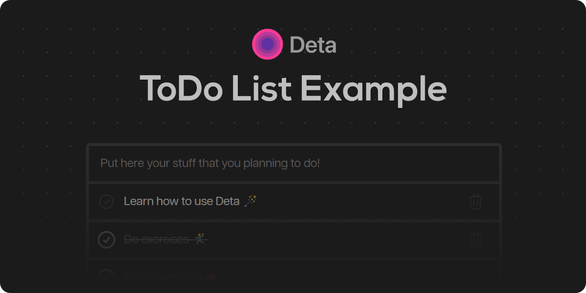

Simple ToDo list application, made with Node.js, Express specialy for launching it on [Deta Space](https://deta.space/)!

<br>

The main components of the project are:

* `/frontend` - Client side app, made with vanilla JavaScript and bundled using Vite

* `/backend` - Simple CRUD Express server that stores data using **Deta Base**

* `Spacefile` - configuration for deploying this app to **Deta Space** 💫

<br>

## Development
1. Install [Node.js](https://nodejs.org/en/). Preferably LTS version. 

2. Install project dependencies, by running these commands:

```bash
# Install backend dependencies
cd backend
npm install

cd ..

# Install frontend dependencies
cd frontend
npm install
```

3. Create `.env` file in the `backend` directory and add `DETA_PROJECT_KEY` to it. Use local development key from the Builder. Your `.env` file should look something like this:

```env
DETA_PROJECT_KEY=a0X8ZXnDcKnR_AjF1UCjqWyRRsvxtPMV84qHX8sYyp23k
```

_TODO: Finish readme_

<br>

## License
MIT